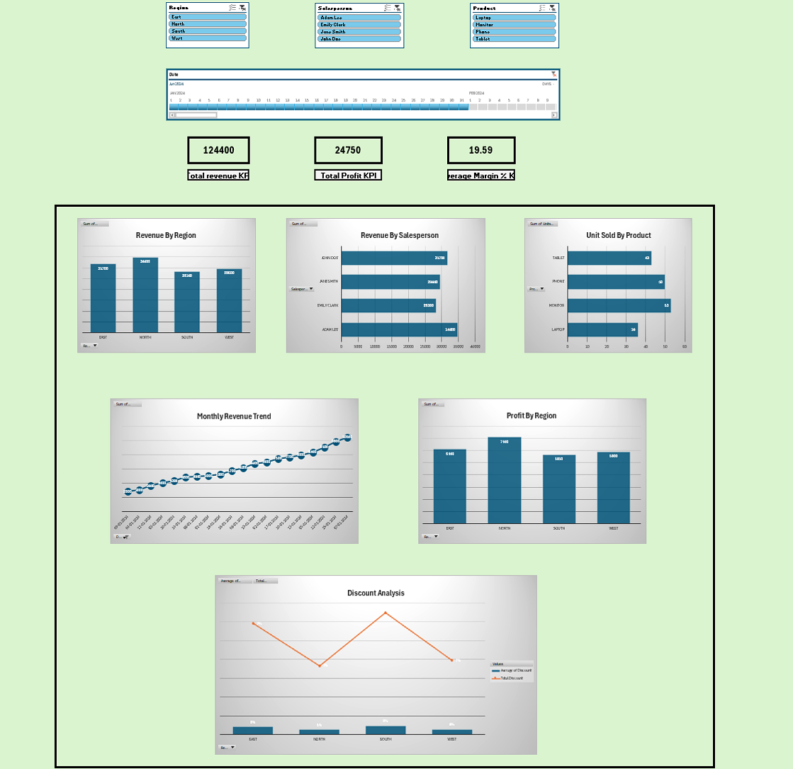

# 📊 MS Excel Assignments & Projects

This repository contains my **Microsoft Excel assignments and practice projects**, created to demonstrate my skills in data handling, analysis, and visualization using Excel.

## 📁 Repository Contents

The repository includes Excel files covering topics such as:
## 📸 Dashboard Preview

- Data Entry & Data Cleaning  
- Formulas & Functions  
- Conditional Formatting  
- Data Validation  
- Pivot Tables & Pivot Charts  
- Data Visualization (Charts & Graphs)  
- Basic Exploratory Data Analysis (EDA)  
- Assignment-based problem solving  

Each file focuses on a specific concept or assignment for better understanding and clarity.

## 🛠 Tools & Skills Used

- Microsoft Excel  
- Data Analysis  
- Data Visualization  
- Logical Functions  
- Lookup Functions (VLOOKUP, HLOOKUP, XLOOKUP)  
- Pivot Tables & Charts  

## 🎯 Purpose of This Repository

- To practice and improve Excel skills  
- To maintain a structured record of assignments  
- To showcase Excel proficiency on GitHub and LinkedIn  
- To help beginners understand Excel concepts through examples  

## 👨‍💻 Author

**Sarthak Sahu**  
Aspiring Data Analyst  

- GitHub: https://github.com/Sarthaksahu1999  

## 📌 Note

These assignments are created for **learning and practice purposes**.  
Feedback and suggestions are always welcome! 😊
